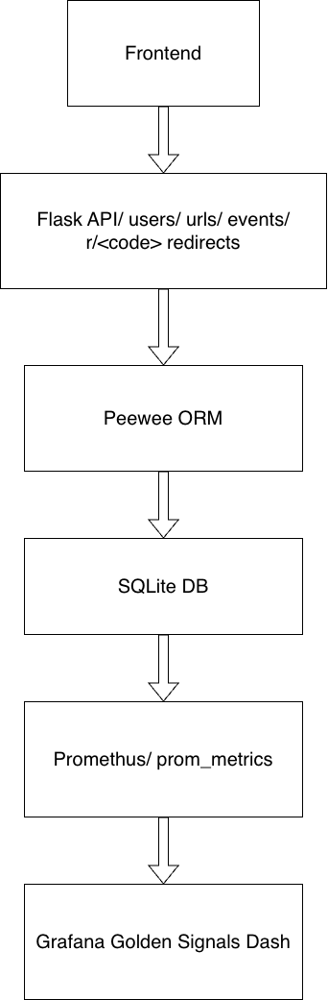
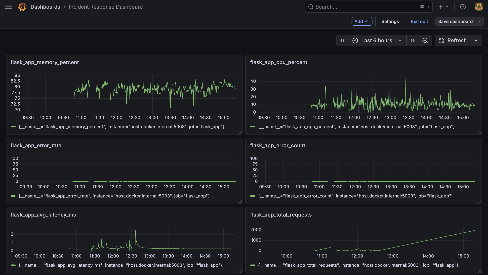
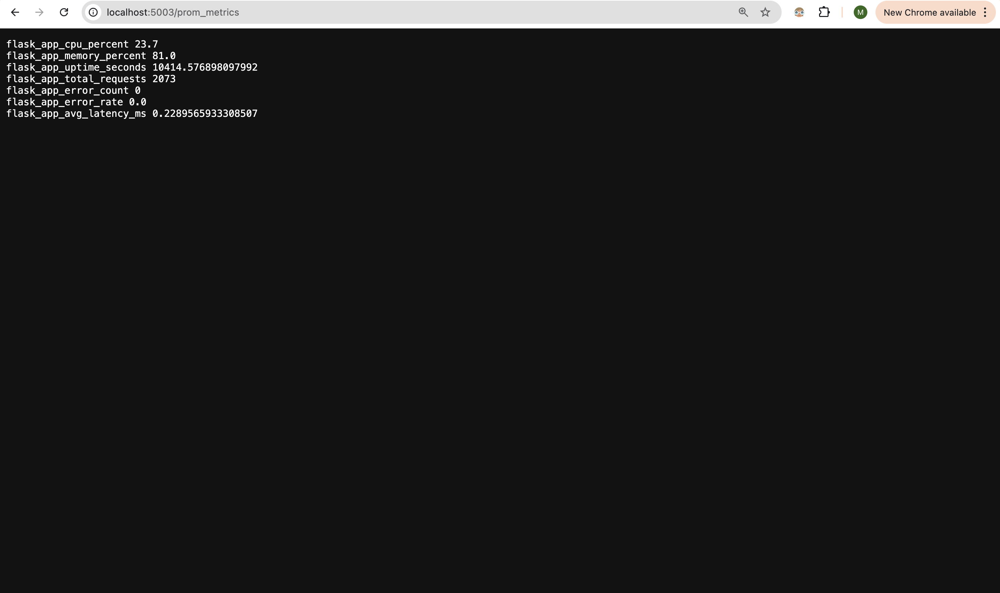
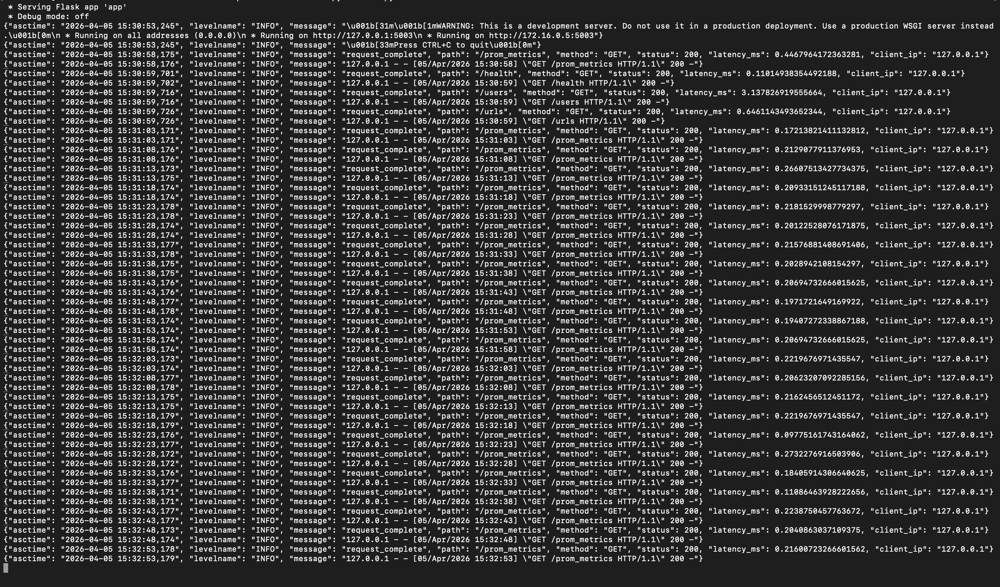
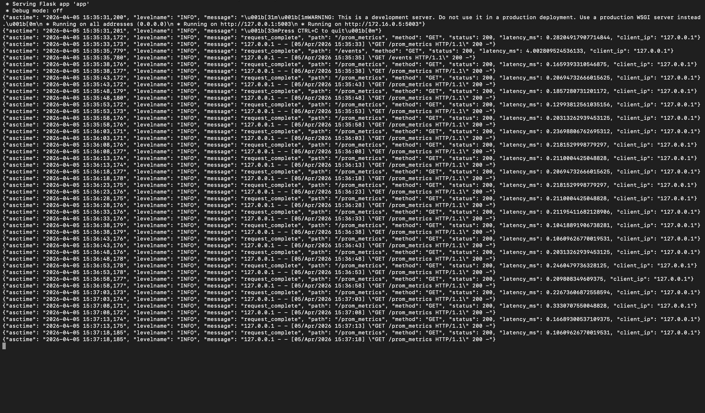
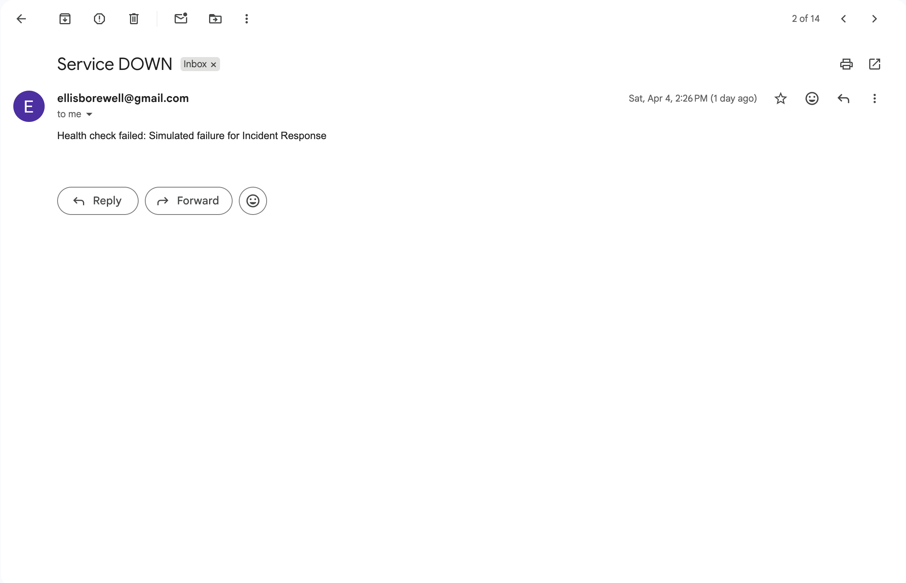

<h1 align="center" style="font-size:42px; font-weight:800; margin-bottom:20px;">
  MLH Production Engineering Hackathon URL Shortener & Incident Response Platform
</h1>

  This project implements a production-grade URL Shortener service with a complete Incident Response (IR) workflow,
  designed and instrumented following Production Engineering best practices. It includes structured logging,
  real-time metrics, a Grafana Golden Signals dashboard, automated alerting, and comprehensive operational documentation.

<h2 style="font-size:30px; font-weight:700;">System Overview</h2>

The URL Shortener backend is implemented in Flask and Peewee ORM, backed by a lightweight SQLite database. The system is fully instrumented:

<ul style="font-size:18px; line-height:1.6;">
  <li><b>Operational Observability:</b> Metrics exported via <code>/prom_metrics</code>, monitored via Prometheus.</li>
  <li><b>Golden Signals Dashboard:</b> A Grafana dashboard tracking latency, traffic, errors, CPU, and memory.</li>
  <li><b>Structured JSON Logging:</b> Machine-parseable logs capturing every request.</li>
  <li><b>Alerting:</b> Automated email alerts for service downtime and high error rates.</li>
  <li><b>Incident Response Workflows:</b> Runbook and RCA included under <code>/docs</code>.</li>
  <li><b>Robust API Surface:</b> Users, URLs, and Events with filtering, deduplication, and redirect logic.</li>
</ul>

<h2 style="font-size:30px; font-weight:700;">Architecture</h2>

This architecture follows a classical web-service design with modern observability enhancements. Data flows through
the Flask API into the database, with Prometheus scrapes feeding visualization panels in Grafana.

<h2 style="font-size:30px; font-weight:700;">Key Observability Screenshots</h2>

<h3 style="font-size:22px; margin-top:25px;">Grafana Dashboard</h3>

<h3 style="font-size:22px; margin-top:25px;">Prometheus Metrics Output</h3>

<h3 style="font-size:22px; margin-top:25px;">Structured JSON Logs</h3>

<h3 style="font-size:22px; margin-top:25px;">Events API Output</h3>

<h3 style="font-size:22px; margin-top:25px;">Alert Email</h3>

<h2 style="font-size:30px; font-weight:700;">Features</h2>

<h3 style="font-size:22px;">URL Shortener</h3>
<ul style="font-size:18px; line-height:1.6;">
  <li>Short URL creation with strong collision-avoidance logic.</li>
  <li>Redirection endpoint at <code>/r/&lt;shortcode&gt;</code>.</li>
  <li>Support for enabling, disabling, and updating URLs.</li>
  <li>Deduplication per user—identical URLs avoid duplicate entries.</li>
  <li>Comprehensive filtering via <code>?user_id</code> and <code>?is_active</code>.</li>
</ul>

<h3 style="font-size:22px;">Users API</h3>
<ul style="font-size:18px; line-height:1.6;">
  <li>Create, list, update, and delete users.</li>
  <li>CSV bulk upload with validation.</li>
  <li>Pagination support for large datasets.</li>
</ul>

<h3 style="font-size:22px;">Events API</h3>
<ul style="font-size:18px; line-height:1.6;">
  <li>Tracks URL lifecycle events (created, updated).</li>
  <li>Supports manual event creation.</li>
  <li>Advanced merging logic prevents duplicate event types.</li>
  <li>Filters by URL, user, or event type.</li>
</ul>

<h2 style="font-size:30px; font-weight:700;">Installation</h2>

<h3 style="font-size:22px;">Dependencies</h3>
<pre><code>uv sync
</code></pre>

<h3 style="font-size:22px;">Run the Service</h3>
<pre><code>uv run python run.py
</code></pre>

<h3 style="font-size:22px;">Verify Operation</h3>
<pre><code>curl http://localhost:5003/health
</code></pre>

<h2 style="font-size:30px; font-weight:700;">API Documentation</h2>

Complete documentation is located in <code>docs/API.md</code>.

<h3 style="font-size:22px;">Users API</h3>
<pre><code>POST    /users
GET     /users
GET     /users/&lt;id&gt;
PUT     /users/&lt;id&gt;
DELETE  /users/&lt;id&gt;
POST    /users/bulk
</code></pre>

<h3 style="font-size:22px;">URLs API</h3>
<pre><code>POST    /urls
GET     /urls
GET     /urls/&lt;id&gt;
PUT     /urls/&lt;id&gt;
DELETE  /urls/&lt;id&gt;
GET     /urls/&lt;shortcode&gt;/redirect
</code></pre>

<h3 style="font-size:22px;">Events API</h3>
<pre><code>POST    /events
GET     /events
GET     /events?url_id=&lt;id&gt;
GET     /events?user_id=&lt;id&gt;
GET     /events?event_type=&lt;type&gt;
</code></pre>

<h2 style="font-size:30px; font-weight:700;">Operational Documentation</h2>

<h3 style="font-size:22px;">Runbook</h3>

Located in <code>docs/RUNBOOK.md</code>. Covers:

<ul style="font-size:18px; line-height:1.6;">
  <li>Service downtime procedures</li>
  <li>Error-rate investigation</li>
  <li>Latency spikes</li>
  <li>Redirect failures</li>
  <li>Database corruption mitigation</li>
</ul>

<h3 style="font-size:22px;">Root Cause Analysis</h3>

Available in <code>docs/RCA.md</code>.

<h2 style="font-size:30px; font-weight:700;">Tech Stack</h2>
<ul style="font-size:18px; line-height:1.6;">
  <li>Python 3.13</li>
  <li>Flask</li>
  <li>Peewee ORM</li>
  <li>SQLite</li>
  <li>Prometheus</li>
  <li>Grafana</li>
  <li>uv package manager</li>
  <li>Docker Compose</li>
</ul>

<h2 style="font-size:30px; font-weight:700;">License</h2>

MIT License

